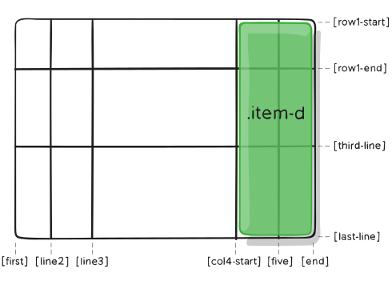
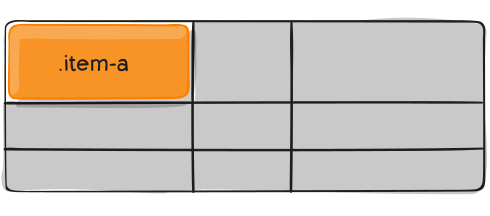

# The basics of HTML5 and CSS3

# 5. Tables and Hyperlinks

Hyperlinks have different types of attributes.

If ```target``` is set to ```_blank```, then the link will be opened inside another tab.

If you want to navigate inside your own website ( not on an external one ) with links, you will have to use anchors. That means that you have to use the ```#{id}``` inside the ```href``` attribute of the link so you can navigate to a specific part of the website that has the given id. Example:

```HTML
<a href="#anchor_name_1">Anchor 1</a>
<a href="#anchor_name_2">Anchor 2</a>
<a href="#anchor_name_3">Anchor 3</a>
<a href="#anchor_name_4">Anchor 4</a>
<a href="#anchor_name_5">Anchor 5</a>
<div class="box">
    <h1 id="anchor_name_1">Anchor 1</h1>
</div>
<div class="box">
    <h1 id="anchor_name_2">Anchor 2</h1>
</div>
<div class="box">
    <h1 id="anchor_name_3">Anchor 3</h1>
</div>
<div class="box">
    <h1 id="anchor_name_4">Anchor 4</h1>
</div>
<div class="box">
    <h1 id="anchor_name_5">Anchor 5</h1>
</div>
```

You can also use this anchors to navigate to specific parts of an external website. Example:

```HTML
<a href="https://www.test_website.com/index.html#HEADLINE">Headline of another website</a>
```

# 6. Grafics and Multimedia

### ``````

With ```src``` and ```alt``` you give the source of the file and a text that is read by screenreaders or that appears in case the image can't load.
With ```title``` you can give a title to the image that will show up when the user hovers the mouse over it.

***Images are not technically inserted on the website, they are linked on the HTML document. The `````` tag represents the space for the image.***

With ```width``` and ```height``` you can adjust the width and the height of the `````` tag where the image will be put. You should add those attributes since it takes a long time for images to load on websites and if you already have a designated place, with specific width and height attributes, then you will know how much space the `````` element will occupy. This helps you a lot because, in this way, you can make sure that the rest of the website and its design can be generated without any issues, since the website already knows how much space the `````` element will occupy.

You can use ```<figure>``` and ```<figcaption>``` in order to describe an image. Example:

```HTML
<figure>
    
    <figcaption>This is the description of the picture.</figcaption>
</figure>
```

In order to work with html mappings you have to create a map with an id and at it to the usermap attribute inside the image that you want to create a mapping for.

Example:

```HTML
    
<map id="my_map" name="my_map">
    <area target="" alt="Alternative Title" title="Title 1" href="" coords="10,20,30,40,50,60,70,80,90,100" shape="poly">
    <area target="" alt="Alternative Title" title="Title 2" href="" coords="110,120,130,140,150,160,170,180,190,200" shape="poly">
</map>
```

You can see that we first just built a normal image and then added the attribute ```usemap``` to the image with the id of the mapping. Inside the ```map``` we add different areas with their descriptions.

You can use the ```<picture>``` tag in order to insert more images with different resolutions for certain media queries.

```HTML
<picture>
    <source media="(min-width:1024px)" srcset="images/test_1024.jpg">
    <source media="(min-width:640)" srcset="images/test_640.jpg">
    <source media="(min-width:480)" srcset="images/test_480.jpg">
</picture>
```

# 7. HTML Forms

You can add a ```fieldset``` in order to summarize/give a title to a form. You can use it to structure your website better. Example:

```HTML
<fieldset>
    <legend><h2>Input</h2></legend>
    <form>
        <label>Username</label>
        <input type="text" placeholder="Username" required>
        <label>Password</label>
        <input type="password" placeholder="Password" required>
    </form>
</fieldset>
```

A ```datalist``` allows you to give only a couple of options to an ```input```.

```HTML
<form>
    Title <input type="text" list="mylist" name="titel">
    <br>
    <datalist id="mylist">
        <option value="Mr"></option>
        <option value="Mrs"></option>
        <option value="Prof."></option>
    </datalist>
</form>
```

If you want to summarize a block of text and add a drop down menu to it whenever you click on the summarized message, you can use a ```details``` tag:

```HTML
<p>Lorem ipsum dolor sit amet.</p>
<details>
    <summary>Lorem, ipsum.</summary>
    <blockquote>Lorem ipsum dolor sit amet consectetur, adipisicing elit. Provident autem labore reprehenderit et placeat, dicta laborum voluptas, nostrum quidem officia delectus. Voluptatem fuga in similique quaerat repellat cupiditate necessitatibus ut?</blockquote>
</details>
```

## Chapter 8 ( Introduction to CSS )

You can import css files inside your css file using the ```@import``` query.

Example:

```CSS
@import url("header.css");
@import url("paragraph.css");

div{
    background-color: blue;
}
```

# 12. CSS Positioning

## CSS Position 

The ```position``` property sets how an element is positioned inside the document. The properties ```top```, ```right```, ```bottom``` and ```left``` determine the final location of the element.

These are the following value that the ```position```  property can take:

```CSS
position: static;
position: relative;
position: absolute;
position: fixed;
position: sticky;

/* Global values */
position: inherit;
position: initial;
position: revert;
position: revert-layer;
position: unset;
```

### Values explained:

This is what our html document looks like before changing the position of elements:


#### ```Static```

***The static value is the default value.*** It means that the element is positioned according to the flow of the document. When an element has the ```static``` position, the properties ```top```, ```right```, ```bottom```, ```left``` and ```z-index``` have *no effect*.

#### ```Relative```

When you first set an element to be positioned ```relative``` you will see that nothing has changes. When an element is positioned ```relative```, then the element isn't taken out of the flow of the document. The element can however change its position using the ```top```, ```right```, ```bottom``` and ```left``` properties. Example:

```CSS
#box5{
    position: relative;
    left: 600px;
}
```


The other elements will behave as if ```#box5``` is still there, even though it has moved. 

***The properties ```top```, ```right```, ```bottom``` and ```left``` only change its position relative to its original position.***

MDN:

> The element is positioned according to the normal flow of the document, and then offset relative to itself based on the values of top, right, bottom, and left. The offset does not affect the position of any other elements; thus, the space given for the element in the page layout is the same as if position were static.

#### ```Absolute```

When an element is positioned ```absolute```, then that element is completely taken out of the flow of the document. All the other elements will behave as if it's simply not there. Just like with ```relative``` positioning, you can change the location using ```top```, ```right```, ```bottom``` and ```left```. 

This is what the element looks like after I've positioned it ```absolute``` with nothing else to it:

```CSS
#box5{
    position: absolute;
}
```


You can see that the element has been taken out of the flow of the document and the other elements behave as if it's not there. The ```box6``` is under ```box5``` now but ```box5``` is shown since it has a higher ```z-index```.

Now, as previously mentioned, we can change its position using the properties ```top```, ```right```, ```bottom``` and ```left```:

```CSS
#box5{
    position: absolute;

    top: 250px;
    right: 30px;
}
```


The element has been positioned to be 30px far from the right side of the document and 250px far from the top side of the document.

The way ```top```, ```right```, ```bottom``` and ```left``` behave is also determined by the closest positioned element of the element that is set to be ```absolute``` ( note that a positioned element is considered an element that has the ```position``` property anything but ```static```, which is the default ```position``` property ).

That means that if the parent element of ```box5``` is set to be for example ```relative```, then that will change the behavior of the ```top```, ```right```, ```bottom``` and ```left``` properties.

Here is an example of how we changed the document before any positioning happened:


We have a ```<main></main>``` tag with some margin and padding and inside we have the boxes.

Let's change ```box5``` and give it a position of ```absolute``` and change its location:

```CSS
#box5{
    position: absolute;
    bottom: 0px;
    right: 0px;
}
```


Now, let's see how this element looks like when we change its parent element to also be positioned ( we will position it ```relative``` ):

```CSS
main {
    margin: auto;
    width: 700px;
    height: 700px;
    padding: 20px;
    border: 3px solid black;

    position: relative;
}

#box5{
    position: absolute;
    bottom: 0px;
    right: 0px;
}
```


Now you can see that the position has changed but it's relative to its parent element ( in this case the ```<main></main>``` element )

MDN:

> The element is removed from the normal document flow, and no space is created for the element in the page layout. It is positioned relative to its closest positioned ancestor, if any; otherwise, it is placed relative to the initial containing block. Its final position is determined by the values of top, right, bottom, and left.
> This value creates a new stacking context when the value of z-index is not auto. The margins of absolutely positioned boxes do not collapse with other margins.

#### ```Fixed```

An element that is positioned to be 'fixed' is taken out of the document flow and is being scrolled with the page.

MDN:

> The element is removed from the normal document flow, and no space is created for the element in the page layout. It is positioned relative to the initial containing block established by the viewport, except when one of its ancestors has a transform, perspective, or filter property set to something other than none (see the CSS Transforms Spec), in which case that ancestor behaves as the containing block. (Note that there are browser inconsistencies with perspective and filter contributing to containing block formation.) Its final position is determined by the values of top, right, bottom, and left.

#### ```Sticky```

An element that is position to be 'sticky' isn't taken out of the document flow

MDN:

> The element is positioned according to the normal flow of the document, and then offset relative to its nearest scrolling ancestor and containing block (nearest block-level ancestor), including table-related elements, based on the values of top, right, bottom, and left. The offset does not affect the position of any other elements.

This value always creates a new stacking context. Note that a sticky element "sticks" to its nearest ancestor that has a "scrolling mechanism" (created when overflow is hidden, scroll, auto, or overlay), even if that ancestor isn't the nearest actually scrolling ancestor. This effectively inhibits any "sticky" behavior (see the GitHub issue on W3C CSSWG).

## CSS global properties

The global properties of most css properties are:

* inherit;
* initial;
* revert;
* revert-layer;
* unset;

### Inherit

The property should received its inherited values.

MDN:

> In CSS, inheritance controls what happens when no value is specified for a property on an element.
> CSS properties can be categorized in two types:
> * inherited properties, which by default are set to the computed value of the parent element
> * non-inherited properties, which by default are set to initial value of the property

### Initial

This means that the property has to revert back to its initial values. The initial settings of a property are its default values.

### Revert

> Specifies behavior that depends on the stylesheet origin to which the declaration belongs:
> * If the rule belongs to the author origin, the revert value rolls back the cascade to the user level, so that the specified values are calculated as if no author-level rules were specified for the element. For purposes of revert, the author origin includes the Override and Animation origins.
> * If the rule belongs to the user origin, the revert value rolls back the cascade to the user-agent level, so that the specified values are calculated as if no author-level or user-level rules were specified for the element.
> * If the rule belongs to the user-agent origin, the revert value acts like unset.

### Revert-layer

> Specifies that all the element's properties should roll back the cascade to a previous cascade layer, if one exists. If no other cascade layer exists, the element's properties will roll back to the matching rule, if one exists, in the current layer or to a previous style origin.

### Unset

Specifies that all the element's properties should be changed to their inherited values if they inherit by default, or to their initial values if not.


## CSS Float and Clear

In order to make elements float left or right use the ```float``` property. In order to clear the floating you must use the ```clear``` property ( clear ```right```, ```left``` or ```both``` ).

## CSS Flexbox

```>```

### Basics and terminology


Since flexbox is a whole module and not a single property, it involves a lot of things including its whole set of properties. Some of them are meant to be set on the container (parent element, known as “flex container”) whereas the others are meant to be set on the children (said “flex items”).

If “regular” layout is based on both block and inline flow directions, the flex layout is based on “flex-flow directions”. Please have a look at this figure from the specification, explaining the main idea behind the flex layout.


Items will be laid out following either the main axis (from main-start to main-end) or the cross axis (from cross-start to cross-end).

* main axis – The main axis of a flex container is the primary axis along which flex items are laid out. Beware, it is not necessarily horizontal; it depends on the flex-direction property (see below).
* main-start | main-end – The flex items are placed within the container starting from main-start and going to main-end.
* main size – A flex item’s width or height, whichever is in the main dimension, is the item’s main size. The flex item’s main size property is either the ‘width’ or ‘height’ property, whichever is in the main dimension.
* cross axis – The axis perpendicular to the main axis is called the cross axis. Its direction depends on the main axis direction.
* cross-start | cross-end – Flex lines are filled with items and placed into the container starting on the cross-start side of the flex container and going toward the cross-end side.
* cross size – The width or height of a flex item, whichever is in the cross dimension, is the item’s cross size. The cross size property is whichever of ‘width’ or ‘height’ that is in the cross dimension.

### Properties for the flex container

#### ```display```

This defines a flex container; inline or block depending on the given value. It enables a flex context for all its direct children.

```CSS
.container {
  display: flex; /* or inline-flex */
}
```

Note that CSS columns have no effect on a flex container.

#### ```flex-direction```


This establishes the main-axis, thus defining the direction flex items are placed in the flex container. Flexbox is (aside from optional wrapping) a single-direction layout concept. Think of flex items as primarily laying out either in horizontal rows or vertical columns.

```CSS
.container {
  flex-direction: row | row-reverse | column | column-reverse;
}
```

* row (default): left to right in ltr; right to left in rtl
* row-reverse: right to left in ltr; left to right in rtl
* column: same as row but top to bottom
* column-reverse: same as row-reverse but bottom to top

#### ```flex-wrap```


By default, flex items will all try to fit onto one line. You can change that and allow the items to wrap as needed with this property.

```CSS
.container {
  flex-wrap: nowrap | wrap | wrap-reverse;
}
```

* nowrap (default): all flex items will be on one line
* wrap: flex items will wrap onto multiple lines, from top to bottom.
* wrap-reverse: flex items will wrap onto multiple lines from bottom to top.

#### ```flex-flow```

This is a shorthand for the flex-direction and flex-wrap properties, which together define the flex container’s main and cross axes. The default value is row nowrap.

```CSS
.container {
  flex-flow: column wrap;
}
```

#### ```justify-content```


This defines the alignment along the main axis. It helps distribute extra free space leftover when either all the flex items on a line are inflexible, or are flexible but have reached their maximum size. It also exerts some control over the alignment of items when they overflow the line.

```CSS
.container {
  justify-content: flex-start | flex-end | center | space-between | space-around | space-evenly | start | end | left | right ... + safe | unsafe;
}
```

* flex-start (default): items are packed toward the start of the flex-direction.
* flex-end: items are packed toward the end of the flex-direction.
* start: items are packed toward the start of the writing-mode direction.
* end: items are packed toward the end of the writing-mode direction.
* left: items are packed toward left edge of the container, unless that doesn’t make sense with the flex-direction, then it behaves like start.
* right: items are packed toward right edge of the container, unless that doesn’t make sense with the flex-direction, then it behaves like end.
* center: items are centered along the line
* space-between: items are evenly distributed in the line; first item is on the start line, last item on the end line
* space-around: items are evenly distributed in the line with equal space around them. Note that visually the spaces aren’t equal, since all the items have equal space on both sides. The first item will have one unit of space against the container edge, but two units of space between the next item because that next item has its own spacing that applies.
* space-evenly: items are distributed so that the spacing between any two items (and the space to the edges) is equal.

#### ```align-items```


This defines the default behavior for how flex items are laid out along the cross axis on the current line. Think of it as the justify-content version for the cross-axis (perpendicular to the main-axis).

```CSS
.container {
  align-items: stretch | flex-start | flex-end | center | baseline | first baseline | last baseline | start | end | self-start | self-end + ... safe | unsafe;
}
```

* stretch (default): stretch to fill the container (still respect min-width/max-width)
* flex-start / start / self-start: items are placed at the start of the cross axis. The difference between these is subtle, and is about respecting the flex-direction rules or the writing-mode rules.
* flex-end / end / self-end: items are placed at the end of the cross axis. The difference again is subtle and is about respecting flex-direction rules vs. writing-mode rules.
* center: items are centered in the cross-axis
* baseline: items are aligned such as their baselines align

#### ```align-content```


This aligns a flex container’s lines within when there is extra space in the cross-axis, similar to how justify-content aligns individual items within the main-axis.

* Note: This property only takes effect on multi-line flexible containers, where flex-wrap is set to either wrap or wrap-reverse). A single-line flexible container (i.e. where flex-wrap is set to its default value, no-wrap) will not reflect align-content.*

```CSS
.container {
  align-content: flex-start | flex-end | center | space-between | space-around | space-evenly | stretch | start | end | baseline | first baseline | last baseline + ... safe | unsafe;
}
```

* normal (default): items are packed in their default position as if no value was set.
* flex-start / start: items packed to the start of the container. The (more supported) flex-start honors the flex-direction while start honors the writing-mode direction.
* flex-end / end: items packed to the end of the container. The (more support) flex-end honors the flex-direction while end honors the writing-mode direction.
* center: items centered in the container
* space-between: items evenly distributed; the first line is at the start of the container while the last one is at the end
* space-around: items evenly distributed with equal space around each line
* space-evenly: items are evenly distributed with equal space around them
* stretch: lines stretch to take up the remaining space

#### ```gap, row-gap, column-gap```


The gap property explicitly controls the space between flex items. It applies that spacing only between items not on the outer edges.

```CSS
.container {
    display: flex;
    ...
    gap: 10px;
    gap: 10px 20px; /* row-gap column gap */
    row-gap: 10px;
    column-gap: 20px;
}
```

The behavior could be thought of as a minimum gutter, as if the gutter is bigger somehow (because of something like justify-content: space-between;) then the gap will only take effect if that space would end up smaller.

It is not exclusively for flexbox, gap works in grid and multi-column layout as well.

### Properties for the flex items

#### ```order```


By default, flex items are laid out in the source order. However, the order property controls the order in which they appear in the flex container.

```CSS
.item {
  order: 5; /* default is 0 */
}
```

Items with the same order revert to source order.

#### ```flex-grow```


This defines the ability for a flex item to grow if necessary. It accepts a unitless value that serves as a proportion. It dictates what amount of the available space inside the flex container the item should take up.

If all items have flex-grow set to 1, the remaining space in the container will be distributed equally to all children. If one of the children has a value of 2, that child would take up twice as much of the space either one of the others (or it will try, at least).

```CSS
.item {
  flex-grow: 4; /* default 0 */
}
```

Negative numbers are invalid.

#### ```flex-shrink```

This defines the ability for a flex item to shrink if necessary.

```CSS
.item {
  flex-shrink: 3; /* default 1 */
}
```

Negative numbers are invalid.

#### ```flex-basis```

This defines the default size of an element before the remaining space is distributed. It can be a length (e.g. 20%, 5rem, etc.) or a keyword. The auto keyword means “look at my width or height property” (which was temporarily done by the main-size keyword until deprecated). The content keyword means “size it based on the item’s content” – this keyword isn’t well supported yet, so it’s hard to test and harder to know what its brethren max-content, min-content, and fit-content do.

```CSS
.item {
  flex-basis:  | auto; /* default auto */
}
```

If set to 0, the extra space around content isn’t factored in. If set to auto, the extra space is distributed based on its flex-grow value. See this graphic.

#### ```flex```

This is the shorthand for flex-grow, flex-shrink and flex-basis combined. The second and third parameters (flex-shrink and flex-basis) are optional. The default is 0 1 auto, but if you set it with a single number value, like flex: 5;, that changes the flex-basis to 0%, so it’s like setting flex-grow: 5; flex-shrink: 1; flex-basis: 0%;.

```CSS
.item {
  flex: none | [ <'flex-grow'> <'flex-shrink'>? || <'flex-basis'> ]
}
```

It is recommended that you use this shorthand property rather than set the individual properties. The shorthand sets the other values intelligently.

#### ```align-self```


This allows the default alignment (or the one specified by align-items) to be overridden for individual flex items.

Please see the align-items explanation to understand the available values.

```CSS
.item {
  align-self: auto | flex-start | flex-end | center | baseline | stretch;
}
```

Note that float, clear and vertical-align have no effect on a flex item.

## CSS Grid

```>```

### Important Terminology

Before diving into the concepts of Grid it’s important to understand the terminology. Since the terms involved here are all kinda conceptually similar, it’s easy to confuse them with one another if you don’t first memorize their meanings defined by the Grid specification. But don’t worry, there aren’t many of them.

#### Grid Container

The element on which ```display: grid``` is applied. It’s the direct parent of all the grid items. In this example container is the grid container.

```HTML
<div class="container">
  <div class="item item-1"> </div>
  <div class="item item-2"> </div>
  <div class="item item-3"> </div>
</div>
```

#### Grid Item

The children (i.e. direct descendants) of the grid container. Here the item elements are grid items, but sub-item isn’t.

```HTML
<div class="container">
  <div class="item"> </div>
  <div class="item">
    <p class="sub-item"> </p>
  </div>
  <div class="item"> </div>
</div>
```

#### Grid Line

The dividing lines that make up the structure of the grid. They can be either vertical (“column grid lines”) or horizontal (“row grid lines”) and reside on either side of a row or column. Here the yellow line is an example of a column grid line.


#### Grid Cell

The space between two adjacent row and two adjacent column grid lines. It’s a single “unit” of the grid. Here’s the grid cell between row grid lines 1 and 2, and column grid lines 2 and 3.


#### Grid Track

The space between two adjacent grid lines. You can think of them as the columns or rows of the grid. Here’s the grid track between the second and third-row grid lines.


#### Grid Area

The total space surrounded by four grid lines. A grid area may be composed of any number of grid cells. Here’s the grid area between row grid lines 1 and 3, and column grid lines 1 and 3.


### Properties for the grid container

#### ```display```

Defines the element as a grid container and establishes a new grid formatting context for its contents.

Values:

* grid – generates a block-level grid
* inline-grid – generates an inline-level grid

```CSS
.container {
    display: grid | inline-grid;
}
```

#### ```grid-template-columns```, ```grid-template-rows```

Defines the columns and rows of the grid with a space-separated list of values. The values represent the track size, and the space between them represents the grid line.

Values:

* ```<track-size>``` – can be a length, a percentage, or a fraction of the free space in the grid (using the fr unit)
* ```<line-name>``` – an arbitrary name of your choosing

```CSS
.container {
  grid-template-columns: ...  ...;
  /* e.g. 
      1fr 1fr
      minmax(10px, 1fr) 3fr
      repeat(5, 1fr)
      50px auto 100px 1fr
  */
  grid-template-rows: ... ...;
  /* e.g. 
      min-content 1fr min-content
      100px 1fr max-content
  */
}
```

Grid lines are automatically assigned positive numbers from these assignments (-1 being an alternate for the very last row).


But you can choose to explicitly name the lines. Note the bracket syntax for the line names:

```CSS
.container {
  grid-template-columns: [first] 40px [line2] 50px [line3] auto [col4-start] 50px [five] 40px [end];
  grid-template-rows: [row1-start] 25% [row1-end] 100px [third-line] auto [last-line];
}
```


Note that a line can have more than one name. For example, here the second line will have two names: row1-end and row2-start:

```CSS
.container {
  grid-template-rows: [row1-start] 25% [row1-end row2-start] 25% [row2-end];
}
```

If your definition contains repeating parts, you can use the repeat() notation to streamline things:

```CSS
.container {
  grid-template-columns: 20px [col-start] 20px [col-start] 20px [col-start];
}
```

If multiple lines share the same name, they can be referenced by their line name and count.

```CSS
.item {
  grid-column-start: col-start 2;
}
```

The fr unit allows you to set the size of a track as a fraction of the free space of the grid container. For example, this will set each item to one third the width of the grid container:

```CSS
.container {
  grid-template-columns: 1fr 1fr 1fr;
}
```

The free space is calculated after any non-flexible items. In this example the total amount of free space available to the fr units doesn’t include the 50px:

```CSS
.container {
  grid-template-columns: 1fr 50px 1fr 1fr;
}
```

#### ```grid-template-areas```

Defines a grid template by referencing the names of the grid areas which are specified with the grid-area property. Repeating the name of a grid area causes the content to span those cells. A period signifies an empty cell. The syntax itself provides a visualization of the structure of the grid.

Values:

* ```<grid-area-name>``` – the name of a grid area specified with grid-area
* ```.``` – a period signifies an empty grid cell
* ```none``` – no grid areas are defined

```CSS
.container {
  grid-template-areas: 
    "<grid-area-name> | . | none | ..."
    "...";
}
```

Example:

```CSS
.item-a {
  grid-area: header;
}
.item-b {
  grid-area: main;
}
.item-c {
  grid-area: sidebar;
}
.item-d {
  grid-area: footer;
}

.container {
  display: grid;
  grid-template-columns: 50px 50px 50px 50px;
  grid-template-rows: auto;
  grid-template-areas: 
    "header header header header"
    "main main . sidebar"
    "footer footer footer footer";
}
```

That’ll create a grid that’s four columns wide by three rows tall. The entire top row will be composed of the header area. The middle row will be composed of two main areas, one empty cell, and one sidebar area. The last row is all footer.


Each row in your declaration needs to have the same number of cells.

You can use any number of adjacent periods to declare a single empty cell. As long as the periods have no spaces between them they represent a single cell.

Notice that you’re not naming lines with this syntax, just areas. When you use this syntax the lines on either end of the areas are actually getting named automatically. If the name of your grid area is foo, the name of the area’s starting row line and starting column line will be foo-start, and the name of its last row line and last column line will be foo-end. This means that some lines might have multiple names, such as the far left line in the above example, which will have three names: header-start, main-start, and footer-start.

#### ```grid-template```

A shorthand for setting grid-template-rows, grid-template-columns, and grid-template-areas in a single declaration.

Values:

* ```none``` – sets all three properties to their initial values
* ```<grid-template-rows>``` / ```<grid-template-columns>``` – sets grid-template-columns and grid-template-rows to the specified values, respectively, and sets grid-template-areas to none

```CSS
.container {
  grid-template: none | <grid-template-rows> / <grid-template-columns>;
}
```

It also accepts a more complex but quite handy syntax for specifying all three. Here’s an example:

```CSS
.container {
  grid-template:
    [row1-start] "header header header" 25px [row1-end]
    [row2-start] "footer footer footer" 25px [row2-end]
    / auto 50px auto;
}
```

That’s equivalent to this:

```CSS
.container {
  grid-template-rows: [row1-start] 25px [row1-end row2-start] 25px [row2-end];
  grid-template-columns: auto 50px auto;
  grid-template-areas: 
    "header header header" 
    "footer footer footer";
}
```

Since grid-template doesn’t reset the implicit grid properties (grid-auto-columns, grid-auto-rows, and grid-auto-flow), which is probably what you want to do in most cases, it’s recommended to use the grid property instead of grid-template.

#### ```column-gap```, ```row-gap```, ```grid-column-gap```, ```grid-row-gap```

Specifies the size of the grid lines. You can think of it like setting the width of the gutters between the columns/rows.

Values:

* ```<line-size>``` – a length value

```CSS
.container {
  /* standard */
  column-gap: <line-size>;
  row-gap: <line-size>;

  /* old */
  grid-column-gap: <line-size>;
  grid-row-gap: <line-size>;
}
```

Example:

```CSS
.container {
  grid-template-columns: 100px 50px 100px;
  grid-template-rows: 80px auto 80px; 
  column-gap: 10px;
  row-gap: 15px;
}
```


The gutters are only created between the columns/rows, not on the outer edges.

Note: The grid- prefix will be removed and grid-column-gap and grid-row-gap renamed to column-gap and row-gap. The unprefixed properties are already supported in Chrome 68+, Safari 11.2 Release 50+, and Opera 54+.

#### ```gap```, ```grid-gap```

A shorthand for row-gap and column-gap

Values:

* ```<grid-row-gap>``` ```<grid-column-gap>``` – length values

```CSS
.container {
  /* standard */
  gap: <grid-row-gap> <grid-column-gap>;

  /* old */
  grid-gap: <grid-row-gap> <grid-column-gap>;
}
```

Example:

```CSS
.container {
  grid-template-columns: 100px 50px 100px;
  grid-template-rows: 80px auto 80px; 
  gap: 15px 10px;
}
```

If no row-gap is specified, it’s set to the same value as column-gap

Note: The grid- prefix is deprecated (but who knows, may never actually be removed from browsers). Essentially grid-gap renamed to gap. The unprefixed property is already supported in Chrome 68+, Safari 11.2 Release 50+, and Opera 54+.

#### ```justify-items```

Aligns grid items along the inline (row) axis (as opposed to align-items which aligns along the block (column) axis). This value applies to all grid items inside the container.

Values:

* start – aligns items to be flush with the start edge of their cell
* end – aligns items to be flush with the end edge of their cell
* center – aligns items in the center of their cell
* stretch – fills the whole width of the cell (this is the default)

```CSS
.container {
  justify-items: start | end | center | stretch;
}
```

Examples:

```CSS
.container {
  justify-items: start;
}
```


```CSS
.container {
  justify-items: end;
}
```


```CSS
.container {
  justify-items: center;
}
```


```CSS
.container {
  justify-items: stretch;
}
```


This behavior can also be set on individual grid items via the justify-self property.

#### ```align-items```

Aligns grid items along the block (column) axis (as opposed to justify-items which aligns along the inline (row) axis). This value applies to all grid items inside the container.

Values:

* stretch – fills the whole height of the cell (this is the default)
* start – aligns items to be flush with the start edge of their cell
* end – aligns items to be flush with the end edge of their cell
* center – aligns items in the center of their cell
* baseline – align items along text baseline. There are modifiers to baseline — first baseline and last baseline which will use the baseline from the first or last line in the case of multi-line text.

```CSS
.container {
  align-items: start | end | center | stretch;
}
```

Examples:

```CSS
.container {
  align-items: start;
}
```


```CSS
.container {
  align-items: end;
}
```


```CSS
.container {
  align-items: center;
}
```


```CSS
.container {
  align-items: stretch;
}
```


This behavior can also be set on individual grid items via the align-self property.

There are also modifier keywords safe and unsafe (usage is like align-items: safe end). The safe keyword means “try to align like this, but not if it means aligning an item such that it moves into inaccessible overflow area”, while unsafe will allow moving content into inaccessible areas (“data loss”).

#### ```place-items```

```place-items``` sets both the align-items and justify-items properties in a single declaration.

Values:

* ```<align-items>``` / ```<justify-items>``` – The first value sets align-items, the second value justify-items. If the second value is omitted, the first value is assigned to both properties.
For more details, see align-items and justify-items.

This can be very useful for super quick multi-directional centering:

```CSS
.center {
  display: grid;
  place-items: center;
}
```

#### ```justify-content```

Sometimes the total size of your grid might be less than the size of its grid container. This could happen if all of your grid items are sized with non-flexible units like px. In this case you can set the alignment of the grid within the grid container. This property aligns the grid along the inline (row) axis (as opposed to align-content which aligns the grid along the block (column) axis).

Values:

* start – aligns the grid to be flush with the start edge of the grid container
* end – aligns the grid to be flush with the end edge of the grid container
* center – aligns the grid in the center of the grid container
* stretch – resizes the grid items to allow the grid to fill the full width of the grid container
* space-around – places an even amount of space between each grid item, with half-sized spaces on the far ends
* space-between – places an even amount of space between each grid item, with no space at the far ends
* space-evenly – places an even amount of space between each grid item, including the far ends

```CSS
.container {
  align-content: start | end | center | stretch | space-around | space-between | space-evenly;    
}
```

Examples:

```CSS
.container {
  align-content: start;    
}
```


```CSS
.container {
  align-content: end;    
}
```


```CSS
.container {
  align-content: center;    
}
```


```CSS
.container {
  align-content: stretch;    
}
```


```CSS
.container {
  align-content: space-around;    
}
```


```CSS
.container {
  align-content: space-between;    
}
```


```CSS
.container {
  align-content: space-evenly;    
}
```


#### ```place-content```

```place-content``` sets both the align-content and justify-content properties in a single declaration.

Values:

* ```<align-content>``` / ```<justify-content>``` – The first value sets align-content, the second value justify-content. If the second value is omitted, the first value is assigned to both properties.
All major browsers except Edge support the place-content shorthand property.

For more details, see align-content and justify-content.

#### ```grid-auto-columns```, ```grid-auto-rows```

Specifies the size of any auto-generated grid tracks (aka implicit grid tracks). Implicit tracks get created when there are more grid items than cells in the grid or when a grid item is placed outside of the explicit grid. (see The Difference Between Explicit and Implicit Grids)

Values:

* ```<track-size>``` – can be a length, a percentage, or a fraction of the free space in the grid (using the fr unit)

```CSS
.container {
  grid-auto-columns: <track-size> ...;
  grid-auto-rows: <track-size> ...;
}
```

To illustrate how implicit grid tracks get created, think about this:

```CSS
.container {
  grid-template-columns: 60px 60px;
  grid-template-rows: 90px 90px;
}
```


This creates a 2 x 2 grid.

But now imagine you use grid-column and grid-row to position your grid items like this:

```CSS
.item-a {
  grid-column: 1 / 2;
  grid-row: 2 / 3;
}
.item-b {
  grid-column: 5 / 6;
  grid-row: 2 / 3;
}
```


We told .item-b to start on column line 5 and end at column line 6, but we never defined a column line 5 or 6. Because we referenced lines that don’t exist, implicit tracks with widths of 0 are created to fill in the gaps. We can use grid-auto-columns and grid-auto-rows to specify the widths of these implicit tracks:

```CSS
.container {
  grid-auto-columns: 60px;
}
```


#### ```grid-auto-flow```

If you have grid items that you don’t explicitly place on the grid, the auto-placement algorithm kicks in to automatically place the items. This property controls how the auto-placement algorithm works.

Values:

* row – tells the auto-placement algorithm to fill in each row in turn, adding new rows as necessary (default)
* column – tells the auto-placement algorithm to fill in each column in turn, adding new columns as necessary
* dense – tells the auto-placement algorithm to attempt to fill in holes earlier in the grid if smaller items come up later

```CSS
.container {
  grid-auto-flow: row | column | row dense | column dense;
}
```

Note that dense only changes the visual order of your items and might cause them to appear out of order, which is bad for accessibility.

Examples:

Consider this HTML:

```HTML
<section class="container">
  <div class="item-a">item-a</div>
  <div class="item-b">item-b</div>
  <div class="item-c">item-c</div>
  <div class="item-d">item-d</div>
  <div class="item-e">item-e</div>
</section>
```

You define a grid with five columns and two rows, and set grid-auto-flow to row (which is also the default):

```CSS
.container {
  display: grid;
  grid-template-columns: 60px 60px 60px 60px 60px;
  grid-template-rows: 30px 30px;
  grid-auto-flow: row;
}
```

When placing the items on the grid, you only specify spots for two of them:

```CSS
.item-a {
  grid-column: 1;
  grid-row: 1 / 3;
}
.item-e {
  grid-column: 5;
  grid-row: 1 / 3;
}
```

Because we set grid-auto-flow to row, our grid will look like this. Notice how the three items we didn’t place (item-b, item-c and item-d) flow across the available rows:


If we instead set grid-auto-flow to column, item-b, item-c and item-d flow down the columns:

```CSS
.container {
  display: grid;
  grid-template-columns: 60px 60px 60px 60px 60px;
  grid-template-rows: 30px 30px;
  grid-auto-flow: column;
}
```


#### ```grid```

A shorthand for setting all of the following properties in a single declaration: grid-template-rows, grid-template-columns, grid-template-areas, grid-auto-rows, grid-auto-columns, and grid-auto-flow (Note: You can only specify the explicit or the implicit grid properties in a single grid declaration).

Values:

* ```none``` – sets all sub-properties to their initial values.
* ```<grid-template>``` – works the same as the grid-template shorthand.
* ```<grid-template-rows>``` / ```[ auto-flow && dense? ] <grid-auto-columns>?``` – sets grid-template-rows to the specified value. If the auto-flow keyword is to the right of the slash, it sets grid-auto-flow to column. If the dense keyword is specified additionally, the auto-placement algorithm uses a “dense” packing algorithm. If grid-auto-columns is omitted, it is set to auto.
* ```[ auto-flow && dense? ] <grid-auto-rows>?``` / ```<grid-template-columns>``` – sets grid-template-columns to the specified value. If the auto-flow keyword is to the left of the slash, it sets grid-auto-flow to row. If the dense keyword is specified additionally, the auto-placement algorithm uses a “dense” packing algorithm. If grid-auto-rows is omitted, it is set to auto.

Examples:

The following two code blocks are equivalent:

```CSS
.container {
  grid: 100px 300px / 3fr 1fr;
}

.container {
  grid-template-rows: 100px 300px;
  grid-template-columns: 3fr 1fr;
}
```

The following two code blocks are equivalent:

```CSS
.container {
  grid: auto-flow / 200px 1fr;
}

.container {
  grid-auto-flow: row;
  grid-template-columns: 200px 1fr;
}
```

The following two code blocks are equivalent:

```CSS
.container {
  grid: auto-flow dense 100px / 1fr 2fr;
}

.container {
  grid-auto-flow: row dense;
  grid-auto-rows: 100px;
  grid-template-columns: 1fr 2fr;
}
```

And the following two code blocks are equivalent:

```CSS
.container {
  grid: 100px 300px / auto-flow 200px;
}

.container {
  grid-template-rows: 100px 300px;
  grid-auto-flow: column;
  grid-auto-columns: 200px;
}
```

It also accepts a more complex but quite handy syntax for setting everything at once. You specify grid-template-areas, grid-template-rows and grid-template-columns, and all the other sub-properties are set to their initial values. What you’re doing is specifying the line names and track sizes inline with their respective grid areas. This is easiest to describe with an example:

```CSS
.container {
  grid: [row1-start] "header header header" 1fr [row1-end]
        [row2-start] "footer footer footer" 25px [row2-end]
        / auto 50px auto;
}
```

That’s equivalent to this:

```CSS
.container {
  grid-template-areas: 
    "header header header"
    "footer footer footer";
  grid-template-rows: [row1-start] 1fr [row1-end row2-start] 25px [row2-end];
  grid-template-columns: auto 50px auto;    
}
```

### Properties for the grid items

#### ```grid-column-start```, ```grid-column-end```, ```grid-row-start```, ```grid-row-end```

Determines a grid item’s location within the grid by referring to specific grid lines. grid-column-start/grid-row-start is the line where the item begins, and grid-column-end/grid-row-end is the line where the item ends.

Values:

* ```<line>``` – can be a number to refer to a numbered grid line, or a name to refer to a named grid line
* ```span <number>``` – the item will span across the provided number of grid tracks
* ```span <name>``` – the item will span across until it hits the next line with the provided name
* ```auto``` – indicates auto-placement, an automatic span, or a default span of one

```CSS
.item {
  grid-column-start: <number> | <name> | span <number> | span <name> | auto;
  grid-column-end: <number> | <name> | span <number> | span <name> | auto;
  grid-row-start: <number> | <name> | span <number> | span <name> | auto;
  grid-row-end: <number> | <name> | span <number> | span <name> | auto;
}
```

Examples:

```CSS
.item-a {
  grid-column-start: 2;
  grid-column-end: five;
  grid-row-start: row1-start;
  grid-row-end: 3;
}
```


```CSS
.item-b {
  grid-column-start: 1;
  grid-column-end: span col4-start;
  grid-row-start: 2;
  grid-row-end: span 2;
}
```


If no grid-column-end/grid-row-end is declared, the item will span 1 track by default.

Items can overlap each other. You can use z-index to control their stacking order.

#### ```grid-column```, ```grid-row```

Shorthand for grid-column-start + grid-column-end, and grid-row-start + grid-row-end, respectively.

Values:

* ```<start-line>``` / ```<end-line>``` – each one accepts all the same values as the longhand version, including span

```CSS
.item {
  grid-column: <start-line> / <end-line> | <start-line> / span <value>;
  grid-row: <start-line> / <end-line> | <start-line> / span <value>;
}
```

Example:

```CSS
.item-c {
  grid-column: 3 / span 2;
  grid-row: third-line / 4;
}
```


If no end line value is declared, the item will span 1 track by default.

#### ```grid-area```

Gives an item a name so that it can be referenced by a template created with the grid-template-areas property. Alternatively, this property can be used as an even shorter shorthand for grid-row-start + grid-column-start + grid-row-end + grid-column-end.

Values:

* ```<name>``` – a name of your choosing
* ```<row-start>``` / ```<column-start>``` / ```<row-end>``` / ```<column-end>``` – can be numbers or named lines

```CSS
.item {
  grid-area: <name> | <row-start> / <column-start> / <row-end> / <column-end>;
}
```

Examples:

As a way to assign a name to the item:

```CSS
.item-d {
  grid-area: header;
}
```

As the short-shorthand for grid-row-start + grid-column-start + grid-row-end + grid-column-end:

```CSS
.item-d {
  grid-area: 1 / col4-start / last-line / 6;
}
```



#### ```justify-self```

Aligns a grid item inside a cell along the inline (row) axis (as opposed to align-self which aligns along the block (column) axis). This value applies to a grid item inside a single cell.

Values:

* start – aligns the grid item to be flush with the start edge of the cell
* end – aligns the grid item to be flush with the end edge of the cell
* center – aligns the grid item in the center of the cell
* stretch – fills the whole width of the cell (this is the default)

```CSS
.item {
  justify-self: start | end | center | stretch;
}
```

Examples:

```CSS
.item-a {
  justify-self: start;
}
```


```CSS
.item-a {
  justify-self: end;
}
```


```CSS
.item-a {
  justify-self: center;
}
```


```CSS
.item-a {
  justify-self: stretch;
}
```


To set alignment for all the items in a grid, this behavior can also be set on the grid container via the justify-items property.

#### ```align-self```

Aligns a grid item inside a cell along the block (column) axis (as opposed to justify-self which aligns along the inline (row) axis). This value applies to the content inside a single grid item.

Values:

* start – aligns the grid item to be flush with the start edge of the cell
* end – aligns the grid item to be flush with the end edge of the cell
* center – aligns the grid item in the center of the cell
* stretch – fills the whole height of the cell (this is the default)

```CSS
.item {
  align-self: start | end | center | stretch;
}
```

Examples:

```CSS
.item-a {
  align-self: start;
}
```


```CSS
.item-a {
  align-self: end;
}
```


```CSS
.item-a {
  align-self: center;
}
```


```CSS
.item-a {
  align-self: stretch;
}
```



To align all the items in a grid, this behavior can also be set on the grid container via the align-items property.

#### ```place-self```

place-self sets both the align-self and justify-self properties in a single declaration.

Values:

* ```auto``` – The “default” alignment for the layout mode.
* ```<align-self>``` / ```<justify-self>``` – The first value sets align-self, the second value justify-self. If the second value is omitted, the first value is assigned to both properties.

Examples:

```CSS
.item-a {
  place-self: center;
}
```


```CSS
.item-a {
  place-self: center stretch;
}
```


All major browsers except Edge support the place-self shorthand property.

### Special Units & Functions

#### ```fr``` units

You’ll likely end up using a lot of fractional units in CSS Grid, like 1fr. They essentially mean “portion of the remaining space”. So a declaration like:

```CSS
grid-template-columns: 1fr 3fr;
```

Means, loosely, 25% 75%. Except that those percentage values are much more firm than fractional units are. For example, if you added padding to those percentage-based columns, now you’ve broken 100% width (assuming a content-box box model). Fractional units also much more friendly in combination with other units, as you can imagine:

```CSS
grid-template-columns: 50px min-content 1fr;
```

#### Sizing Keywords

When sizing rows and columns, you can use all the lengths you are used to, like px, rem, %, etc, but you also have keywords:

* ```min-content```: the minimum size of the content. Imagine a line of text like “E pluribus unum”, the min-content is likely the width of the word “pluribus”.
* ```max-content```: the maximum size of the content. Imagine the sentence above, the max-content is the length of the whole sentence.
* ```auto```: this keyword is a lot like fr units, except that they “lose” the fight in sizing against fr units when allocating the remaining space.
* ```fit-content```: use the space available, but never less than min-content and never more than max-content.
* ```fractional units```: see above

#### Sizing Functions

* The minmax() function does exactly what it seems like: it sets a minimum and maximum value for what the length is able to be. This is useful for in combination with relative units. Like you may want a column to be only able to shrink so far. This is extremely useful and probably what you want:

```CSS
grid-template-columns: minmax(100px, 1fr) 3fr;
```

* The min() function.
* The max() function.

#### The ```repeat()``` Function and Keywords

The repeat() function can save some typing:

```CSS
grid-template-columns:
  1fr 1fr 1fr 1fr 1fr 1fr 1fr 1fr;

/* easier: */
grid-template-columns:
  repeat(8, 1fr);

/* especially when: */
grid-template-columns:
  repeat(8, minmax(10px, 1fr));

```

But ```repeat()``` can get extra fancy when combined with keywords:

* ```auto-fill```: Fit as many possible columns as possible on a row, even if they are empty.
* ```auto-fit```: Fit whatever columns there are into the space. Prefer expanding columns to fill space rather than empty columns.

This bears the most famous snippet in all of CSS Grid and one of the all-time great CSS tricks:

```CSS
grid-template-columns: 
  repeat(auto-fit, minmax(250px, 1fr));
```

The difference between the keywords is spelled out in detail here.

#### Masonry

An experimental feature of CSS grid is masonry layout. Note that there are lots of approaches to CSS masonry, but mostly of them are trickery and either have major downsides or aren’t what you quite expect.

The spec has an official way now, and this is behind a flag in Firefox:

```CSS
.container {
  display: grid;
  grid-template-columns: repeat(4, 1fr);
  grid-template-rows: masonry;
}
```

#### Subgrid

Subgrid is an extremely useful feature of grids that allows grid items to have a grid of their own that inherits grid lines from the parent grid.

```CSS
.parent-grid {
  display: grid;
  grid-template-columns: repeat(9, 1fr);
}
.grid-item {
  grid-column: 2 / 7;

  display: grid;
  grid-template-columns: subgrid;
}
.child-of-grid-item {
  /* gets to participate on parent grid! */
  grid-column: 3 / 6;
}
```

This is only supported in Firefox right now, but it really needs to get everywhere.

It’s also useful to know about display: contents;. This is not the same as subgrid, but it can be a useful tool sometimes in a similar fashion.

```HTML
<div class="grid-parent">

  <div class="grid-item"></div>
  <div class="grid-item"></div>

  <ul style="display: contents;">
    <!-- These grid-items get to participate on 
         the same grid!-->
    <li class="grid-item"></li>
    <li class="grid-item"></li>
  </ul>

</div>
```